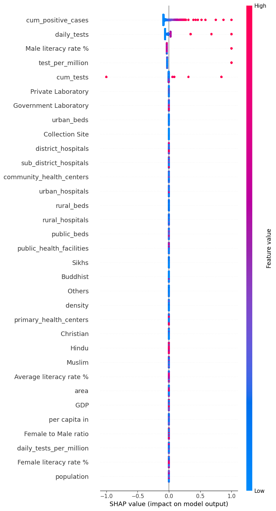
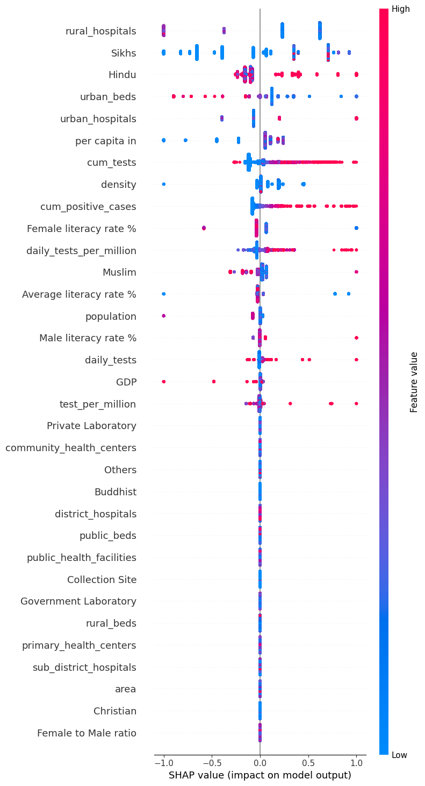

# India_Covid_Prediction

Predicting COVID-19 death rates in India using socioeconomic features.

---

## Table of Contents

- [Project Overview](#project-overview)
- [Data Description](#data-description)
- [Installation](#installation)
- [Usage](#usage)
- [Evaluation](#evaluation)
- [Results](#results)
- [Contact](#contact)
- [License](#license)

---

## Project Overview
  
Machine learning based inferance of factors leading to higher pandemic spread 
---

## Data Description

### Sources

1. [Kaggle Socio-economical Dataset:](https://www.kaggle.com/datasets/samyakjain2052/indian-states-population-gdp-religion-sex-ratio)  
  

Dataset containing socio-economical features of states in India.  
Many of the features are used in this project to answer the reasearch question.

2. [Covid-19 India Reports](https://www.kaggle.com/code/sauravmishra1710/covid-19-india-reports-indiafightscorona/input?select=complete.csv)

Dataset that contains more useful socio-economical features, for example the amount of hospitals, amount of hospital beds etc.  

3. [Covid By Day India](https://covidtoday.github.io/backend/)
  
Dataset that contains the amout of sick, dead and cured people every day from the start of 2020 to the end of 2022


---

## Installation

Requires **Python 3.11**.  
Reccomended to use Anaconda.
This Repository was built on a windows and VSCode framework.  
Different frameworks may not work properly with path definitions.


### Clone the repository

```
git clone https://github.com/SwaneGhost/India_Covid_Prediction.git
```
```
cd India_Covid_Prediction
```

### Create environment

Using Conda:  
```
conda env create -f environment.yaml
```
```
conda activate india_covid_pred
```
or with pip:
```
pip install -r requirements.txt
```

## Usage

In the folder ```Data/Train``` there is a ```train_data.csv``` file.  
In order to retrain and predict using any of the models, replace the file with your own csv file.  
> Note: The models require a target column and they drop the dates (can be removed from the code), and states column is used for grouping

To select the model used go to ```Scripts/main.py``` and choose the model.  
After each run of XGB, HGB and SVR the results reflect on the notebooks.


## Evaluation

| Model  | MAE         | RMSE        | R² Score |
|--------|-------------|-------------|----------|
| HGBR   | 9,909.73    | 40,576.05   | 0.9924   |
| XGBR   | 15,195.56   | 59,386.51   | 0.9836   |
| SVR    | 140,077.65  | 308,219.64  | 0.5590   |
| LASSO  | 180,699.74  | 326,762.98  | 0.7602   |
  
HGBR has the best results overall in predicting the amount of sick people.

## Results

### Histogram Gradient Boosing Regressor SHAP


### Extreme Gradient Boosing Regressor SHAP


### Conclusion

From the shap figures the better model relied only on the cumulative sick patients for predictions.  
The model may be better to apply for a pandemic, the XGB did show us some influence from the socio-economical features.


## Contact

Denis - denisst@post.bgu.ac.il  
Noa - noapatch@post.bgu.ac.il  
Yaki - yakin@post.bgu.ac.il  
Dan - danzas@post.bgu.ac.il  
TODO add more mails

## License

BSD - clause 3 licence


